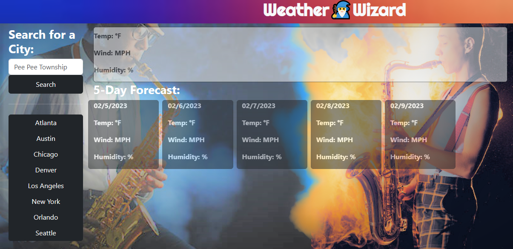
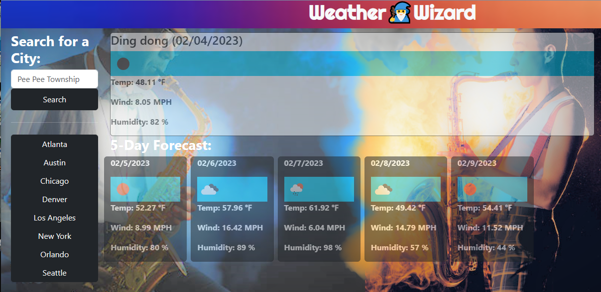

# hot-or-not

## Description

WHEN someone desires to know the current and future (5-day) weather of a particular city.
THEN they can visit my page with and have a wonderful experience with the visuals of ~🥶COLD❄~ and ~🔥HOT🥵~ as well as useful info displayed.

- My motivation for this project was to create a weather app that would tell the user the current weather and a 5-day forecast of any city they desire to search. 
- I learned a lot about how to use data returned from an API and makie it into a functional, easy to read, and fun experience.

## Installation

N/A

## Usage
Visit the site: 
https://d-lil.github.io/hot-or-not/

When you first visit the site (if you haven't and haven't searched any cities on it before) you will be presented with this page. You may search any city in the search bar and either hit enter or click the "Search" button to find your results. You may also click a selected city on the left hand side as well if one of those are the cities you are looking for weather for.

When the results are pulled up- it will give you the city name, today's date, an icon of the current weather, the temp, wind, and humidity, as well as a 5-day forecast for that location. The current city you have searched for or selected will be stored in local storage, so you may feel free to refresh or leave and return to the page and that city's current temperatures will continue to be displayed.

## Credits

The -beautiful- background I made myself, I probably should have linked the sources from the stock images I used to smash this beauty together, but I cannot remember the locations for them.

The banner of gradient colors I did snag the link for, though. I did flip the image horizontally to match the flow of cool to warm colors I used in the background pic.

https://www.google.com/imgres?imgurl=https%3A%2F%2Fwww.shutterstock.com%2Fimage-illustration%2Fmystery-cosmic-abstract-background-yellow-260nw-1193228887.jpg&imgrefurl=https%3A%2F%2Fwww.shutterstock.com%2Fsearch%2Fhot-cold-gradient&tbnid=Q18Vn8yf1W5OMM&vet=12ahUKEwjgoNLkz_D8AhVDx8kDHZ0oDTYQMygAegUIARC-AQ..i&docid=dAJi8RNwZFxg3M&w=364&h=280&q=hot%20to%20cold%20gradient&ved=2ahUKEwjgoNLkz_D8AhVDx8kDHZ0oDTYQMygAegUIARC-AQ

Also, I got stuck with the page adding icons to the icons already existing so I got some feedback from Ben Sboto that he cleared his card elements each time. I used that idea to find a way to remove all image elements already existing on the page each time the function to pull weather data was run.

## License

The MIT License (MIT)

Copyright (c) 2023 Daniel Liljegren

Permission is hereby granted, free of charge, to any person obtaining a copy of this software and associated documentation files (the "Software"), to deal in the Software without restriction, including without limitation the rights to use, copy, modify, merge, publish, distribute, sublicense, and/or sell copies of the Software, and to permit persons to whom the Software is furnished to do so, subject to the following conditions:

The above copyright notice and this permission notice shall be included in all copies or substantial portions of the Software.

THE SOFTWARE IS PROVIDED "AS IS", WITHOUT WARRANTY OF ANY KIND, EXPRESS OR IMPLIED, INCLUDING BUT NOT LIMITED TO THE WARRANTIES OF MERCHANTABILITY, FITNESS FOR A PARTICULAR PURPOSE AND NONINFRINGEMENT. IN NO EVENT SHALL THE AUTHORS OR COPYRIGHT HOLDERS BE LIABLE FOR ANY CLAIM, DAMAGES OR OTHER LIABILITY, WHETHER IN AN ACTION OF CONTRACT, TORT OR OTHERWISE, ARISING FROM, OUT OF OR IN CONNECTION WITH THE SOFTWARE OR THE USE OR OTHER DEALINGS IN THE SOFTWARE.

